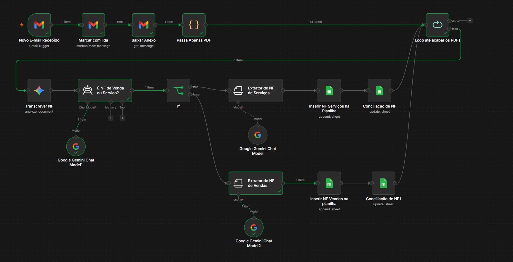
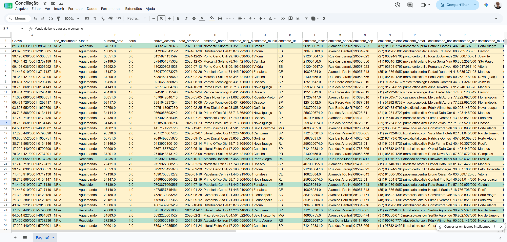

# ⚙️ Case: Invoice Reconciliation — Automação de Conciliação de Notas Fiscais

Atividade acadêmica desenvolvida como parte da pós-graduação em **Data Analytics e AI for Business** pela FNAT (Fundação de Negócios, Analytics e Tecnologia) — 2026.

---

## Contexto

A Axis Solutions é uma empresa brasileira especializada em soluções de tecnologia e serviços corporativos. Com o crescimento acelerado das operações, o processo manual de conciliação de notas fiscais recebidas por e-mail passou a consumir horas do time financeiro diariamente, além de ser suscetível a erros humanos.

O desafio proposto foi desenvolver uma automação capaz de substituir esse processo manual, identificando, processando e conciliando notas fiscais automaticamente.

---

## O Problema

O analista financeiro precisava diariamente:

- Acessar a caixa de e-mails e identificar mensagens com anexos de notas fiscais
- Baixar os PDFs manualmente
- Extrair as informações relevantes de cada nota
- Registrar os dados em planilhas
- Comparar com o controle interno de notas esperadas para conciliar os registros

Com o aumento do volume de operações, esse processo se tornou inescalável.

---

## A Solução

Foi desenvolvida uma automação completa utilizando **n8n** e **Google Gemini** que executa todo o fluxo automaticamente:

1. Monitora continuamente a caixa de entrada de e-mails
2. Identifica e-mails com anexos e filtra apenas arquivos PDF
3. Transcreve o conteúdo da nota fiscal usando LLM
4. Classifica automaticamente se é NF-e (venda) ou NFS-e (serviço)
5. Extrai todas as informações relevantes e registra na planilha correta
6. Realiza a conciliação automática atualizando o status na planilha de controle
7. Marca o e-mail como lido após o processamento

---

## Arquitetura do Fluxo

---

## Resultado

As linhas em verde representam notas fiscais que foram recebidas e conciliadas automaticamente pelo sistema.

---

## Indicadores de Eficiência

- **E-mails não lidos:** caixa limpa indica que a automação está processando normalmente
- **Status na planilha de conciliação:** acompanhamento em tempo real de notas Aguardando vs Recebidas
- **Histórico de execuções no n8n:** taxa de sucesso e identificação de erros por etapa do fluxo

---

## Ferramentas Utilizadas

- **n8n** — orquestração do fluxo de automação
- **Google Gemini (LLM)** — transcrição e extração de dados dos PDFs
- **Google Sheets** — registro das notas fiscais e planilha de conciliação
- **Gmail** — monitoramento da caixa de entrada

---

## Arquivos do Repositório
case-invoice-reconciliation/
├── README.md
├── Automacao_de_NFs.json              # Fluxo exportado do n8n (importável)
├── Invoice_Reconciliation.pdf         # Documento original do case (FNAT)
├── Invoice_Reconciliation_Respostas.pdf  # Respostas e análise desenvolvidas
├── fluxo_n8n.png                      # Print do fluxo no n8n
└── conciliacao.png                    # Print da planilha de conciliação

---

## Como importar o fluxo no n8n

1. Acesse seu n8n
2. Clique em **New Workflow**
3. Clique no menu e selecione **Import from file**
4. Selecione o arquivo `Automacao_de_NFs.json`

---

## Sobre

Análise e automação desenvolvidas de forma independente com base no enunciado proposto pela FNAT. Os dados são fictícios e utilizados exclusivamente para fins acadêmicos e de portfólio.
